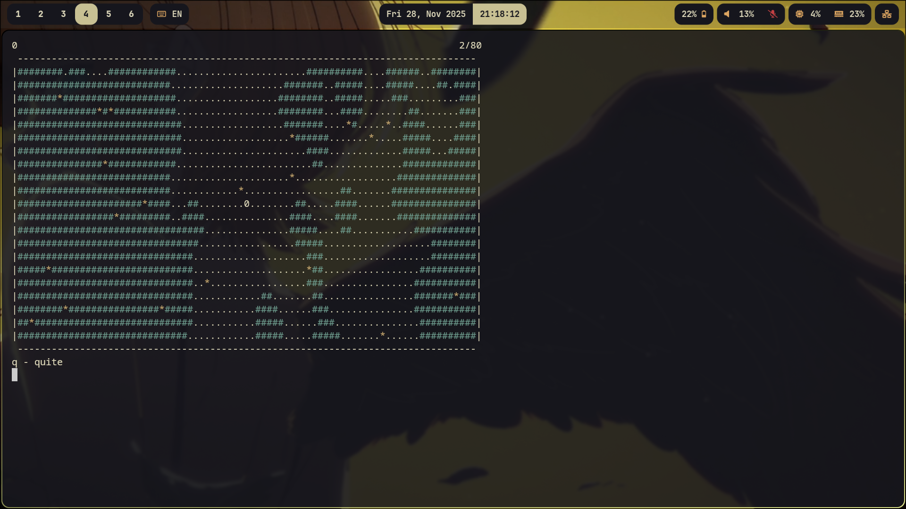

# Zero-min game

# Explanations
Menu:
- continue:  continue current level
- restart level: restart current level
- full restart: restart full game (that mean that current level set to 1) 

Movement:
- a move left
- w move up
- d move right
- s move down

# Settings
You can change the settings by editing "constant.h" (but something might break :)).

To rebuild the game after any changes to the game files, run the "build.sh" script. 
It generates the "tmpmain" executable.
